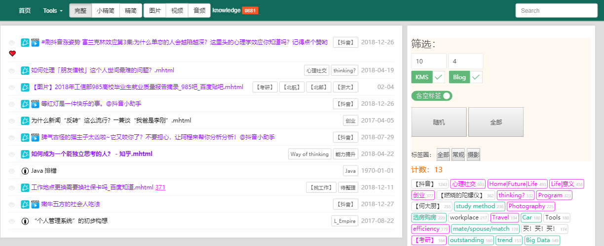

# knowledgeBase
管理个人知识库
基于CodeIgniter框架
系统运行环境 PHP+MySQL

## 开发初衷：
收藏了很多东西，但是不会再去看。
	随机浏览。自定义配置。
收藏了很多东西，但是找不到。
	基于标签检索
收藏了很多在浏览器收藏夹。但用的时候却发现404了。
	离线保存原版网页，防止404。

# 在线演示
http://www.youku.com/brucelian

功能演示：
1、一键入库（mhtml）
2、随机列表
3、插入新标签
4、管理标签（XXXXXXXXXXXXX）
5、修改时效、重要、收益
6、添加备注
7、二维码查看原网站
8、修改title
9、已阅
10、完整|精简|小精简
11、storyline

## 功能介绍
标签管理

## 安装步骤
一、按引导程序填写配置
	数据库用户名、数据库密码、数据库名称、数据表前缀
	仓库路径

# 安装步骤

推荐使用 XMAPP 下载地址

1、访问 /install.php 按提示

1、初始化数据库

1、安装 Codeigniter 框架 V3.1.6

2、拷入 L_base 代码（C\M\V）

2、ueditor 配置

3、设置 application/config.php
		【添加】
		date_default_timezone_set('Asia/Shanghai');

		$config['repo_root'] = iconv("UTF-8", "GB2312//IGNORE", 'C:\\Users\\bruce\\Desktop\\音视频系统\\');		// 仓库1 根目录
		$config['repo2_root'] = iconv("UTF-8", "GB2312//IGNORE", 'D:\\mhtml系统\\');		// 仓库2 根目录
		$config['repo3_root'] = 'E:\\';													// 仓库3 根目录

		$config['kms_mhtml_dir'] = 'mhtml\\';											// mhtml文件夹
		$config['kms_video_dir'] = 'video\\';											// 视频文件夹
		$config['kms_audio_dir'] = 'audio\\';											// 音频文件夹

		$config['auto_up_path'] = iconv("UTF-8", "GB2312//IGNORE", 'C:\\Users\\bruce\\Desktop\\音视频系统\\_up\\');	// 补丁目录（自动分拣）
		$config['auto_up_path_big'] = 'E:\\_up\\';									// 补丁目录（自动分拣，移动硬盘）

		【修改】
		$config['index_page'] = '';
		$config['base_url']	= 'http://localhost:2017/L_base/';

4、设置 application/database.php
		'username' => 'root',
		'password' => '*********',
		'database' => 'L_base',

5、设置 routes.php
		$route['(:any)/(:any)'] = '$1/$2';

6、创建 .htaccess 文件
		RewriteEngine On
		RewriteCond %{REQUEST_FILENAME} !-f
		RewriteCond %{REQUEST_FILENAME} !-d
		RewriteRule ^(.*)$ index.php/$1 [L]

system/core/Common.php
		if ( ! function_exists('smart_time'))
		{
			/**
			 * 智能时间
			 * （5分钟前  半小时前  1小时前  昨天  2天前  8-16）
			 */
			function smart_time($unix_time)
			{
				$interval = time() - $unix_time;
				
				$day_old = strtotime(date('Y-m-d', $unix_time));
				$day_now = strtotime(date('Y-m-d', time()));
				$interval_day = ($day_now - $day_old)/3600/24;

				$interval_h = $interval/3600;
				$interval_m = $interval/60;

				if( $interval >= 0 ){
					if($unix_time<100000000){
						if($unix_time>=3600*24*30 && $unix_time % 3600*24*30 == 0){
							return '每月';
						}else if($unix_time>=3600*24*7 && $unix_time % 3600*24*7 == 0){
							return '每周';
						}else if($unix_time>=3600*24 && $unix_time % 3600*24 == 0){
							return '每天';
						}
					}

					if( date('Y',$unix_time) != date('Y',time()) ){		// 跨年
						return date('Y-m-d', $unix_time);
					}else if( $interval_day > 9 ){			// 大于10天
						return date('m-d', $unix_time);
					}else if( $interval_day > 2 ){			// 大于2天
						return $interval_day.'天前';
					}else if($interval_day>1){				// 前天
						return $interval_day.'天前';
					}else if($interval_day>0){				// 昨天
						return '昨天';
					}else if($interval_h>1){				// 大于1小时
						return (int)$interval_h.'小时前';
					}else if($interval_m>1){				// 大于1分钟
						return (int)$interval_m.'分钟前';
					}else{
						return '刚刚';
					}
				}else{
					return '未来时==>'.$unix_time;
				}
			}
		}

		// ------------------------------------------------------------------------

		if ( ! function_exists('quick_md5'))
		{
			/**
			 * 快速型 文件 MD5 计算
			 */
			function quick_md5($file_path)
			{
				if(file_exists($file_path)){
					$size = @filesize( $file_path );
					if($size>1024*1024*5){
						$fp = fopen($file_path,"r");
						$str = fread($fp,1024*1024*5);
						return md5($str);
					}else{
						return md5_file($file_path);
					}
				}
			}
		}

二、【系统自动】
	生成 tag_circle：1=>knowledge
	设置 config.php
		$kms_dir = '';
	修改 database.php：
		'database' => '',
		'dbprefix' => '',
	生成注册表文件
		获取当前物理路径

修改系统名后，需要做：
1、congif.php							$config['base_url']	= 'http://localhost:2018/L_base/';

四、运行注册表

（ffmpeg）

## 说明
 将下载的 mhtml、mp4、mp3、doc 等文件放入 _up 文件夹
 修改Chrome设置为mhtml单文件

二维码（目前仅mhtml文件）

range设置

删除文件

修改标题

备注

一键入库

随机15篇